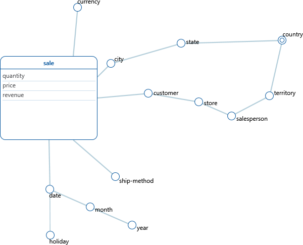

# dw-project

## 1 - Operational data sources inspection and profiling

To import the data I wrote the initDb.sh script.

The script streamlines the database initialization process and solves the following error I have encountered:

- the database "student" may not exist in postgres. If it does not exist, it is created.

- some CSV files contained some empty lines that gave errors when imported by Postgres. The empty lines are therefore removed

- the EOLs of the CVS files were CTRLF. This may be a problem on the linux server. I coverted the EOLS of the files to LF. 

- the AdventureworksDb.sql file imports the files using the space as a separator, while the values in the CSV files are separated by Tabs. I fixed the sql script. 

## 2 - Conceptual design

I decided to analysize one fact: Sales.

I started the process by analysing the ER schema (AdventureWorkdsDbDiagram) and then I decided dimensions ad measures for the fact.

### Sale Fact

The Sale Fact most interesting measures are quantity, unit price and revenue.

The most interesting dimension root I've found are Product, Customer, City and Date, Currency and Ship-method.

#### Dimensions

Here I present an overview of the dimensions of the Sale fact:

- product
    - subcategory
        - category
- ship-method
- currency
- customer
     - store
         - salesperson
             - territory
                 - country
- city
    - province
        - country
- date
    - month
        - year
    - holiday

Customer and City share the country attribute.

---
##### Dynamicity

Product and its categorization may be dynamic. There may be a change in how a product is classified but this should happen quite unfrequently.

Customer may move to a different store quite often and the store may be assigned to a different salesperson.

SalesPerson may move to a different territory and I expect this to be something to be careful about. I consider instead unlikely that a territory is assigned to a different country.

City, province and country are dimensions that I expect to have only a small chance to change.

Date is fixed.

### Workload

I present here a list of logical queries:

#### q1

The sum of all revenues for the year 2013 for the product category "Bikes"

Sale[category = 'Bikes', year=2013].revenue

    select round(sum(d.unitprice * (1 - d.unitpricediscount) * d.orderqty * coalesce(c.averagerate, 1)),2) as revenue
    from production.product p 
    right join sales.salesorderdetail d on p.productid = d.productid 
    join sales.salesorderheader h on h.salesorderid = d.salesorderid
    left join sales.currencyrate c on h.currencyrateid = c.currencyrateid
    left join production.productsubcategory ps on p.productsubcategoryid = ps.productsubcategoryid
    left join production.productcategory pc on ps.productcategoryid = pc.productcategoryid
    where extract(year from h.orderdate) = 2013
    and pc.name = 'Bikes';

#### q2

The list of the sums of all revenues for all the years divided by product category

Sale[category, year].revenue

    select pc.name as category,
        extract(year from h.orderdate) as year, 
        round(sum(d.unitprice * (1 - d.unitpricediscount) * d.orderqty * coalesce(c.averagerate, 1)),2) as revenue
    from production.product p 
    right join sales.salesorderdetail d on p.productid = d.productid 
    join sales.salesorderheader h on h.salesorderid = d.salesorderid
    left join sales.currencyrate c on h.currencyrateid = c.currencyrateid
    left join production.productsubcategory ps on p.productsubcategoryid = ps.productsubcategoryid
    left join production.productcategory pc on ps.productcategoryid = pc.productcategoryid
    group by category, year 
    order by category, year;

#### q3

The list of all products of X category that generated a revenue greater than 200 during the week before Christmas of 2012 in the UK

Sale[date>=18/12/2012 AND date<=25/12/2012, revenue> 200, country='UK'].product

    select distinct p.productid, p.name
    from production.product p 
    right join sales.salesorderdetail d on p.productid = d.productid 
    join sales.salesorderheader h on h.salesorderid = d.salesorderid
    left join sales.currencyrate c on h.currencyrateid = c.currencyrateid
    join sales.salesterritory t on h.territoryid = t.territoryid
    join person.countryregion country on country.countryregioncode = t.countryregioncode
    where country.name = 'United Kingdom'
    and h.orderdate between ('2012-12-25'::date - '1 week'::interval) and '2012-12-25'::date
    group by country.countryregioncode, p.productid, p.name
    having sum(d.unitprice * (1 - d.unitpricediscount) * d.orderqty * coalesce(c.averagerate, 1)) >= 1500

#### q4

The list of all cities where the product 'Mountain-200 Silver, 42' has been sold at least 5 times in the same date in 2013

Sale[product='Mountain-200 Silver, 42', date, year=2013, quantity>=5].city

    select distinct h.orderdate, (a.city || ', ' || s.stateprovincecode) as city
    from production.product p 
    right join sales.salesorderdetail d on p.productid = d.productid 
    join sales.salesorderheader h on h.salesorderid = d.salesorderid
    left join sales.currencyrate c on h.currencyrateid = c.currencyrateid
    join person.address a on h.shiptoaddressid = a.addressid
    join person.stateprovince s on a.stateprovinceid = s.stateprovinceid
    where p.name = 'Mountain-200 Silver, 42'
    and extract(year from h.orderdate) = 2013
    group by city, s.stateprovincecode, h.orderdate
    having sum(d.orderqty) >= 5;

#### q5

The average revenue for all the currencies by year

Sale[currency, year].revenue

    select coalesce(c.tocurrencycode, 'USD') as currency, 
        round(sum(d.unitprice * (1 - d.unitpricediscount) * d.orderqty * coalesce(c.averagerate, 1)),2)
    from sales.salesorderheader h
    left join sales.salesorderdetail d on h.salesorderid = d.salesorderid
    left join sales.currencyrate c on h.currencyrateid = c.currencyrateid
    group by currency;

#### q6

Quantity of product sent by shipping method for every country

Sale[country, ship-method].quantity

    select country.name as countryname,
        sm.name as shipmethodname,
        sum (d.orderqty) as quantity
    from sales.salesorderheader h
    left join sales.salesorderdetail d on h.salesorderid = d.salesorderid
    join person.address a on h.shiptoaddressid = a.addressid
    join person.stateprovince s on a.stateprovinceid = s.stateprovinceid
    join purchasing.shipmethod sm on h.shipmethodid = sm.shipmethodid
    join person.countryregion country on country.countryregioncode = s.countryregioncode
    group by countryname, shipmethodname
    order by countryname, shipmethodname;Sale[year, sales-person, category='Bikes'].quantity

#### q7

Quantity of bikes sold every year by every sales person.

Sale[year, salesperson, category='Bikes'].quantity

    select extract(year from h.orderdate) as year, 
        pe.firstname || ' ' || pe.lastname as fullname, 
        sum(d.orderqty) as bikesold
    from production.product p 
    right join sales.salesorderdetail d on p.productid = d.productid 
    join sales.salesorderheader h on h.salesorderid = d.salesorderid
    left join sales.currencyrate c on h.currencyrateid = c.currencyrateid
    left join production.productsubcategory ps on p.productsubcategoryid = ps.productsubcategoryid
    left join production.productcategory pc on ps.productcategoryid = pc.productcategoryid
    right join sales.customer cu on h.customerid = cu.customerid
    right join sales.store st on cu.storeid = st.businessentityid
    right join sales.salesperson sp on st.salespersonid = sp.businessentityid
    right join person.person pe on sp.businessentityid = pe.businessentityid
    where pc.name = 'Bikes'
    group by year, pe.businessentityid, fullname
    order by year, bikesold desc;

#### q8

Quantity of bikes sold per year in every store which sold at least 200

Sale[year, store, category='Bikes', quantity>=200].quantity

    select extract(year from h.orderdate) as year, 
        st.name as name, 
        sum(d.orderqty) as bikesold
    from production.product p 
    right join sales.salesorderdetail d on p.productid = d.productid 
    join sales.salesorderheader h on h.salesorderid = d.salesorderid
    left join sales.currencyrate c on h.currencyrateid = c.currencyrateid
    left join production.productsubcategory ps on p.productsubcategoryid = ps.productsubcategoryid
    left join production.productcategory pc on ps.productcategoryid = pc.productcategoryid
    right join sales.customer cu on h.customerid = cu.customerid
    right join sales.store st on cu.storeid = st.businessentityid
    right join sales.salesperson sp on st.salespersonid = sp.businessentityid
    right join person.person pe on sp.businessentityid = pe.businessentityid
    where pc.name = 'Bikes'
    group by year, st.businessentityid, st.name
    having sum(d.orderqty) >= 200
    order by year, bikesold desc;

#### q9

Quantity of bikes sold in every store which sold at least 200

Sale[store, category='Bikes', quantity>=200].quantity

    select st.name as name, 
        sum(d.orderqty) as bikesold
    from production.product p 
    right join sales.salesorderdetail d on p.productid = d.productid 
    join sales.salesorderheader h on h.salesorderid = d.salesorderid
    left join sales.currencyrate c on h.currencyrateid = c.currencyrateid
    left join production.productsubcategory ps on p.productsubcategoryid = ps.productsubcategoryid
    left join production.productcategory pc on ps.productcategoryid = pc.productcategoryid
    right join sales.customer cu on h.customerid = cu.customerid
    right join sales.store st on cu.storeid = st.businessentityid
    right join sales.salesperson sp on st.salespersonid = sp.businessentityid
    right join person.person pe on sp.businessentityid = pe.businessentityid
    where pc.name = 'Bikes'
    group by st.businessentityid, st.name
    having sum(d.orderqty) >= 200
    order by bikesold desc;

##### Assumptions

- I assume that the sales.salesorderdetail.unitprice is the unit price *before* the discount (sales.salesorderdetail.unitpricediscount) application.

- When considering the measure "revenue" I always mean the actual revenue value converted in USD.

- As for the dimension "city", attribute city-name is  "city-name, state-province" due to the ambiguity name we have with the city name only. I assume there can be no two cities with the same name inside the same province.

## 3 - Data warehouse ROLAP logical design

### Data Volume

The sale fact includes 121317 events.

The following table shows the cardinality of every dimension:

| Dimension name  | Cardinality |
|-----------------|-------------|
| product         | 504         |
| date            | 1126        |
| shipping-method | 5           |
| customer        | 19820       |
| currency        | 105         |
| city            | 613         |

The maximum cardinality for the Sale event is ~ 4 * 10^16

The sparsity of the schema is 3 * 10^(-11).

### ROLAP schema

The ROLAP schema created from the logical modelling is the one shown in the figure.

The sale fact is converted into the sale table, as well as the main dimentions.

Ship-method, Currency and Date are quite straightforward to convert. They are converted in a single table where the attributes become the fields of the table.

Product is a more complex dimention. I decided to use a star schema with a rollback approach (type 3) to manage the dynamicity of the dimention.

With the City dimention I decided to use a mix of a star and a snowflake schema, snowflaking on the country attribute, since this attribute is shared with another dimension hierarchy.

The Customer dimention is the most dynamic one. I've decided to use again a mix of star and snowflake schema, snowflaking on the SalesPerson and Country attributes. On the first one because it may be useful for the views, and the second one to avoid data duplication. In the case of the Customer dimension I care only about the most recent values, so I don't keep track the historical values so I just take the today-for-yesterday approach (type 1).

### Data warehouse creation

The data warehouse design on Postgres, starting from the ROLAP schema, was pretty straighforward. 

I had to decide how to represent the date values. I decided to encode the years by using only a numer, the months by using a varchar (with a format 'mm-yyyy') and the date by using a timestamp.

I added a column 'exid' to some of the data warehouse tables as a reference to the original table (with no foreign key for portability reasons) to simplify the ETL process of the next phase.

I renamed some columns for practical reasons. For instance 'from' became 'fromts' and 'to' became 'tots'.

### Data warehouse data insertion

I decided to program all the ETL process by using exclusevely Postgres.

The date field posed some challenges since it's not a real table in the source db. I decided to generate programatically all the values for the table for the days going from 1/1/2000 to 31/12/2020. 

I decided to handle missing data by adding some fake values to some dimensional tables. For instance I created a tuple *'no country'* in the country table, a *'no category'* in the category table.

I also replaced the null values in the star schemas with fake values. For instances customers without a store associated had null replaced with *'no store'* and product with no subcategories has null replaced with *'no subcategories'*.

Since I wanted to use the city dimension, but there was no city unique identifier in the source db, I decided to encode the cities by using the format *"city-name, state-province"*. I assume this encoding is non-ambiguous.

I also assumed that when no currency was present for a sale, the currency actually used was the USD.

### Views

By analasying the queries I decided to add the views representing these secondary facts:

- Sales by year and category
- Sales by country

#### Sales by year and category

The pattern of this view is {year, category, shipgmethod, city, customer, currency}.

The secondary fact of the sales by year and category can be used to optimize queries q1, q2, q7, q8 and q9.

#### Sales by country

The pattern of this view is {year, category, shipmethod, country, currency}.

The secondary fact of the sales by country can be used to optimize queries q3 and q6.

## OLAP Queries

### The workload

The queries rewritten to use the rolap model:

#### q1

The sum of all revenues for the year 2013 for the product category "Bikes"

Sale[category = 'Bikes', year=2013].revenue

    select sum(s.revenue)
    from rolap.salebyyearandcategory s
    join rolap.year y on s.yearid = y.yearid
    join rolap.category c on s.categoryid = c.categoryid
    where y.year = 2013
    and c.category = 'Bikes';

#### q2

The list of the sums of all revenues for all the years divided by product category

Sale[category, year].revenue

    select c.category,
        y.year,
        sum(s.revenue)
    from rolap.salebyyearandcategory s
    join rolap.year y on s.yearid = y.yearid
    join rolap.category c on s.categoryid = c.categoryid
    group by c.category, y.year
    order by c.category, y.year;

#### q3

The list of all products of X category that generated a revenue greater than 200 during the week before Christmas of 2012 in the UK

Sale[date>=18/12/2012 AND date<=25/12/2012, revenue> 200, country='UK'].product

    select p.exid as productid, p.name as product
    from rolap.salebycountry s
    join rolap.product p on s.productid = p.productid
    join rolap.country c on s.countryid = c.countryid
    join rolap.date d on s.dateid = d.dateid
    where c.name = 'United Kingdom'
    and d.date between ('2012-12-25'::date - '1 week'::interval) and '2012-12-25'::date
    group by p.exid, p.name
    having sum(s.revenue) >= 1500;

#### q4

The list of all cities where the product 'Mountain-200 Silver, 42' has been sold at least 5 times in the same date in 2013

Sale[product='Mountain-200 Silver, 42', date, year=2013, quantity>=5].city

    select d.date, c.name as city
    from rolap.sale s
    join rolap.product p on s.productid = p.productid
    join rolap.date d on s.dateid = d.dateid
    join rolap.year y on d.yearid = y.yearid
    join rolap.city c on s.cityid = c.cityid
    where p.name = 'Mountain-200 Silver, 42'
    and year = 2013
    group by d.date, c.name
    having sum(s.quantity) >= 5;

#### q5

The average revenue for all the currencies by year

Sale[currency, year].revenue

    select c.currencycode, y.year, sum(revenue)
    from rolap.sale s
    join rolap.date d on s.dateid = d.dateid
    join rolap.year y on d.yearid = y.yearid
    join rolap.currency c on s.currencyid = c.currencyid
    group by c.currencycode, y.year;

#### q6

Quantity of product sent by shipping method for every country

Sale[country, ship-method].quantity

    select c.name as country, sm.name as shipmethod, sum(quantity)
    from rolap.salebycountry s
    join rolap.country c on s.countryid = c.countryid
    join rolap.shipmethod sm on s.shipmethodid = sm.shipmethodid
    group by c.name, sm.name
    order by c.name, sm.name;

#### q7

Quantity of bikes sold every year by every sales person.

Sale[year, salesperson, category='Bikes'].quantity

    select y.year as year,
        sp.name as fullname,
        sum(s.revenue) as bikesold
    from rolap.salebyyearandcategory s
    join rolap.year y on s.yearid = y.yearid
    join rolap.category c on s.categoryid = c.categoryid
    join rolap.customer cu on s.customerid = cu.customerid
    join rolap.salesperson sp on cu.salespersonid = sp.salespersonid
    where sp.name <> 'no salesperson'
    group by y.year, fullname
    order by y.year, bikesold desc;

#### q8

Quantity of bikes sold per year in every store which sold at least 200

Sale[year, store, category='Bikes', quantity>=200].quantity

    select y.year as year,
        cu.store as store,
        sum(s.quantity) as bikesold
    from rolap.salebyyearandcategory s
    join rolap.year y on s.yearid = y.yearid
    join rolap.category c on s.categoryid = c.categoryid
    join rolap.customer cu on s.customerid = cu.customerid
    where cu.store <> 'no store'
    and c.category = 'Bikes'
    group by y.year, store
    having sum(quantity) >= 200
    order by y.year, bikesold desc;

#### q9

Quantity of bikes sold in every store which sold at least 200

Sale[store, category='Bikes', quantity>=200].quantity

    select cu.store as store,
        sum(s.quantity) as bikesold
    from rolap.salebyyearandcategory s
    join rolap.category c on s.categoryid = c.categoryid
    join rolap.customer cu on s.customerid = cu.customerid
    where cu.store <> 'no store'
    and c.category = 'Bikes'
    group by store
    having sum(quantity) >= 200
    order by bikesold desc;

#### Note

With the queries involving prices and revenues I noted that small differences betweeen the 2 different versions of the query are possible. This is due to rounding errors on the calculations.
