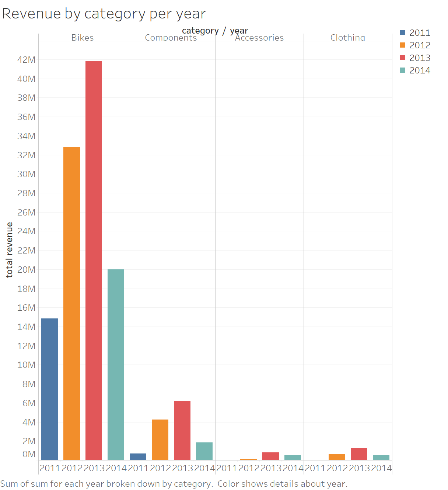
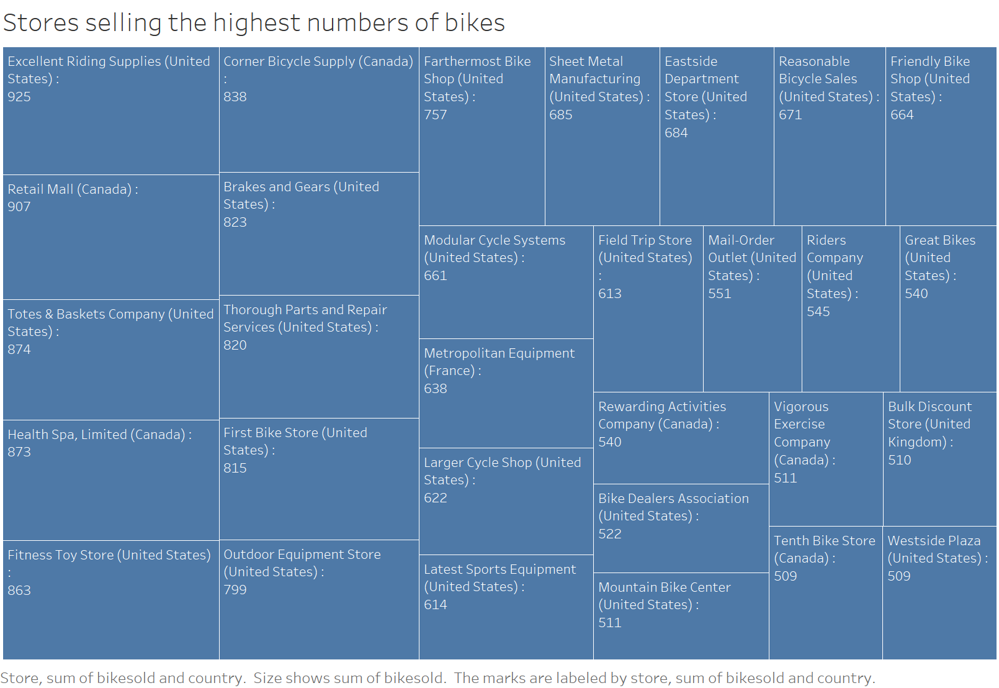
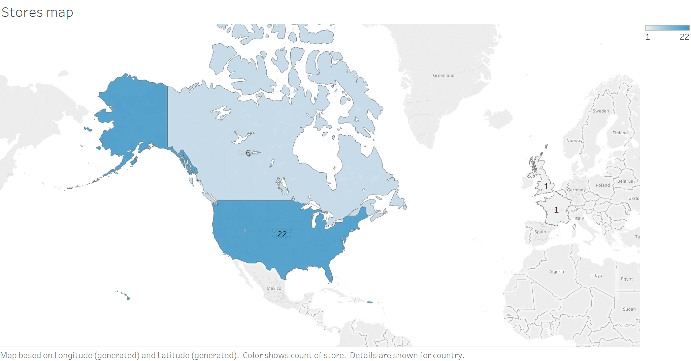
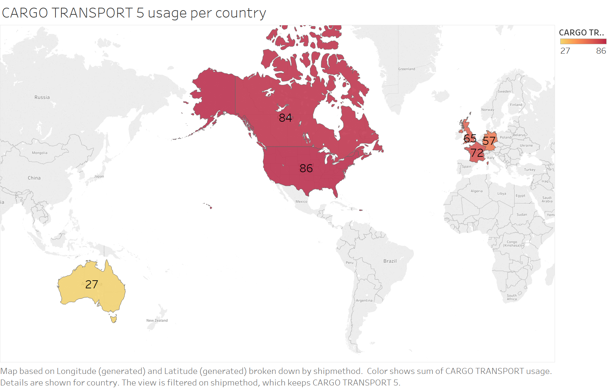
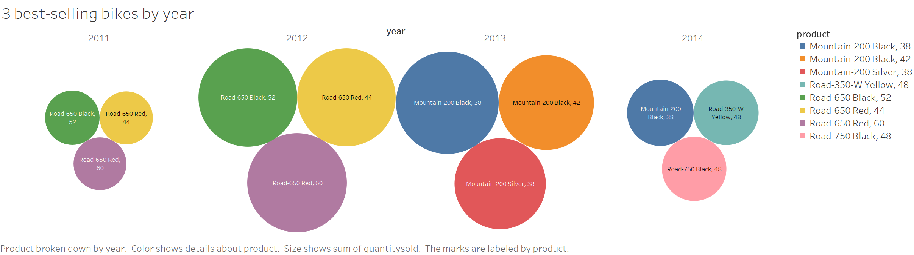
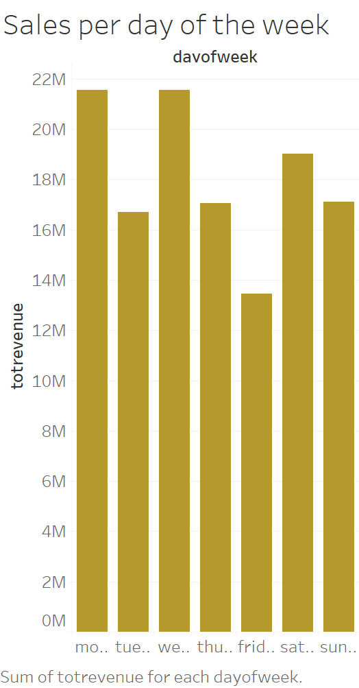

# dw-project

## 0 - Basic instructions

To run the project docker image go the root folder and run:

    docker-compose up -d

To login on the container use ssh with user "student" and password "foobar" on port 2023.

## 1 - Operational data sources inspection and profiling

To import the data I wrote the initDb.sh script.

The script streamlines the database initialization process and solves the following error I have encountered:

- the database "student" may not exist in postgres. If it does not exist, it is created.

- some CSV files contained some empty lines that gave errors when imported by Postgres. The empty lines are therefore removed

- the EOLs of the CVS files were CTRLF. This may be a problem on the linux server. I coverted the EOLS of the files to LF.

- the AdventureworksDb.sql file imports the files using the space as a separator, while the values in the CSV files are separated by Tabs. I fixed the sql script. 

## 2 - Conceptual design

I decided to analysize one fact: Sales.

I started the process by analysing the ER schema (AdventureWorkdsDbDiagram) and then I decided dimensions ad measures for the fact.

### Sale Fact

The Sale Fact most interesting measures are quantity, unit price and revenue.

The most interesting dimension root I've found are Product, Customer, City and Date, Currency and Ship-method.

#### Dimensions

Here I present an overview of the dimensions of the Sale fact:

- product
    - subcategory
        - category
- ship-method
- currency
- customer
     - store
         - salesperson
             - territory
                 - country
- city
    - province
        - country
- date
    - month
        - year
    - holiday

Customer and City share the country attribute.

##### Dynamicity

Product and its categorization may be dynamic. There may be a change in how a product is classified but this should happen quite unfrequently.

Customer may move to a different store quite often and the store may be assigned to a different salesperson.

SalesPerson may move to a different territory and I expect this to be something to be careful about. I consider instead unlikely that a territory is assigned to a different country.

City, province and country are dimensions that I expect to have only a small chance to change.

Date is fixed.

### Workload

I present here a list of logical queries:

#### q1

The sum of all revenues for the year 2013 for the product category "Bikes"

Sale[category = 'Bikes', year=2013].revenue

    select round(sum(d.unitprice * (1 - d.unitpricediscount) * d.orderqty * coalesce(c.averagerate, 1)),2) as revenue
    from production.product p 
    right join sales.salesorderdetail d on p.productid = d.productid 
    join sales.salesorderheader h on h.salesorderid = d.salesorderid
    left join sales.currencyrate c on h.currencyrateid = c.currencyrateid
    left join production.productsubcategory ps on p.productsubcategoryid = ps.productsubcategoryid
    left join production.productcategory pc on ps.productcategoryid = pc.productcategoryid
    where extract(year from h.orderdate) = 2013
    and pc.name = 'Bikes';

#### q2

The list of the sums of all revenues for all the years divided by product category

Sale[category, year].revenue

    select pc.name as category,
        extract(year from h.orderdate) as year, 
        round(sum(d.unitprice * (1 - d.unitpricediscount) * d.orderqty * coalesce(c.averagerate, 1)),2) as revenue
    from production.product p 
    right join sales.salesorderdetail d on p.productid = d.productid 
    join sales.salesorderheader h on h.salesorderid = d.salesorderid
    left join sales.currencyrate c on h.currencyrateid = c.currencyrateid
    left join production.productsubcategory ps on p.productsubcategoryid = ps.productsubcategoryid
    left join production.productcategory pc on ps.productcategoryid = pc.productcategoryid
    group by category, year 
    order by category, year;

#### q3

The list of all products of X category that generated a revenue greater than 200 during the week before Christmas of 2012 in the UK

Sale[date>=18/12/2012 AND date<=25/12/2012, revenue> 200, country='UK'].product

    select distinct p.productid, p.name
    from production.product p 
    right join sales.salesorderdetail d on p.productid = d.productid 
    join sales.salesorderheader h on h.salesorderid = d.salesorderid
    left join sales.currencyrate c on h.currencyrateid = c.currencyrateid
    join sales.salesterritory t on h.territoryid = t.territoryid
    join person.countryregion country on country.countryregioncode = t.countryregioncode
    where country.name = 'United Kingdom'
    and h.orderdate between ('2012-12-25'::date - '1 week'::interval) and '2012-12-25'::date
    group by country.countryregioncode, p.productid, p.name
    having sum(d.unitprice * (1 - d.unitpricediscount) * d.orderqty * coalesce(c.averagerate, 1)) >= 1500

#### q4

The list of all cities where the product 'Mountain-200 Silver, 42' has been sold at least 8 times in the same date in 2013

Sale[product='Mountain-200 Silver, 42', date, year=2013, quantity>=5].city

    select (a.city || ', ' || s.stateprovincecode) as city
    from production.product p 
    right join sales.salesorderdetail d on p.productid = d.productid 
    join sales.salesorderheader h on h.salesorderid = d.salesorderid
    left join sales.currencyrate c on h.currencyrateid = c.currencyrateid
    join person.address a on h.shiptoaddressid = a.addressid
    join person.stateprovince s on a.stateprovinceid = s.stateprovinceid
    where p.name = 'Mountain-200 Silver, 42'
    and extract(year from h.orderdate) = 2013
    group by city, s.stateprovincecode, h.orderdate
    having sum(d.orderqty) >= 8;

#### q5

The average revenue for all the currencies by year

Sale[currency, year].revenue

    select coalesce(c.tocurrencycode, 'USD') as currency, 
        round(sum(d.unitprice * (1 - d.unitpricediscount) * d.orderqty * coalesce(c.averagerate, 1)),2)
    from sales.salesorderheader h
    left join sales.salesorderdetail d on h.salesorderid = d.salesorderid
    left join sales.currencyrate c on h.currencyrateid = c.currencyrateid
    group by currency;

#### q6

Quantity of product sent by shipping method for every country

Sale[country, ship-method].quantity

    select country.name as countryname,
        sm.name as shipmethodname,
        sum (d.orderqty) as quantity
    from sales.salesorderheader h
    left join sales.salesorderdetail d on h.salesorderid = d.salesorderid
    join person.address a on h.shiptoaddressid = a.addressid
    join person.stateprovince s on a.stateprovinceid = s.stateprovinceid
    join purchasing.shipmethod sm on h.shipmethodid = sm.shipmethodid
    join person.countryregion country on country.countryregioncode = s.countryregioncode
    group by countryname, shipmethodname
    order by countryname, shipmethodname;Sale[year, sales-person, category='Bikes'].quantity

#### q7

Quantity of bikes sold every year by every sales person.

Sale[year, salesperson, category='Bikes'].quantity

    select extract(year from h.orderdate) as year, 
        pe.firstname || ' ' || pe.lastname as fullname, 
        sum(d.orderqty) as bikesold
    from production.product p 
    right join sales.salesorderdetail d on p.productid = d.productid 
    join sales.salesorderheader h on h.salesorderid = d.salesorderid
    left join sales.currencyrate c on h.currencyrateid = c.currencyrateid
    left join production.productsubcategory ps on p.productsubcategoryid = ps.productsubcategoryid
    left join production.productcategory pc on ps.productcategoryid = pc.productcategoryid
    right join sales.customer cu on h.customerid = cu.customerid
    right join sales.store st on cu.storeid = st.businessentityid
    right join sales.salesperson sp on st.salespersonid = sp.businessentityid
    right join person.person pe on sp.businessentityid = pe.businessentityid
    where pc.name = 'Bikes'
    group by year, pe.businessentityid, fullname
    order by year, bikesold desc;

#### q8

Quantity of bikes sold per year in every store which sold at least 200

Sale[year, store, category='Bikes', quantity>=200].quantity

    select extract(year from h.orderdate) as year, 
        st.name as name, 
        sum(d.orderqty) as bikesold
    from production.product p 
    right join sales.salesorderdetail d on p.productid = d.productid 
    join sales.salesorderheader h on h.salesorderid = d.salesorderid
    left join sales.currencyrate c on h.currencyrateid = c.currencyrateid
    left join production.productsubcategory ps on p.productsubcategoryid = ps.productsubcategoryid
    left join production.productcategory pc on ps.productcategoryid = pc.productcategoryid
    right join sales.customer cu on h.customerid = cu.customerid
    right join sales.store st on cu.storeid = st.businessentityid
    right join sales.salesperson sp on st.salespersonid = sp.businessentityid
    right join person.person pe on sp.businessentityid = pe.businessentityid
    where pc.name = 'Bikes'
    group by year, st.businessentityid, st.name
    having sum(d.orderqty) >= 200
    order by year, bikesold desc;

#### q9

Quantity of bikes sold in every store which sold at least 200

Sale[store, category='Bikes', quantity>=200].quantity

    select st.name as name, 
        sum(d.orderqty) as bikesold
    from production.product p 
    right join sales.salesorderdetail d on p.productid = d.productid 
    join sales.salesorderheader h on h.salesorderid = d.salesorderid
    left join sales.currencyrate c on h.currencyrateid = c.currencyrateid
    left join production.productsubcategory ps on p.productsubcategoryid = ps.productsubcategoryid
    left join production.productcategory pc on ps.productcategoryid = pc.productcategoryid
    right join sales.customer cu on h.customerid = cu.customerid
    right join sales.store st on cu.storeid = st.businessentityid
    right join sales.salesperson sp on st.salespersonid = sp.businessentityid
    right join person.person pe on sp.businessentityid = pe.businessentityid
    where pc.name = 'Bikes'
    group by st.businessentityid, st.name
    having sum(d.orderqty) >= 200
    order by bikesold desc;

##### Assumptions

- I assume that the sales.salesorderdetail.unitprice is the unit price *before* the discount (sales.salesorderdetail.unitpricediscount) application.

- When considering the measure "revenue" I always mean the actual revenue value converted in USD.

- As for the dimension "city", attribute city-name is  "city-name, state-province" due to the ambiguity name we have with the city name only. I assume there can be no two cities with the same name inside the same province.

## 3 - Data warehouse ROLAP logical design

### Data Volume

The sale fact includes 121317 events.

The following table shows the cardinality of every dimension:

| Dimension name  | Cardinality |
|-----------------|-------------|
| product         | 504         |
| date            | 1126        |
| shipping-method | 5           |
| customer        | 19820       |
| currency        | 105         |
| city            | 613         |

The maximum cardinality for the Sale event is ~ 4 * 10^16

The sparsity of the schema is 3 * 10^(-11).

### ROLAP schema

The ROLAP schema created from the logical modelling is the one shown in the figure.

The sale fact is converted into the sale table, as well as the main dimentions.

Ship-method, Currency and Date are quite straightforward to convert. They are converted in a single table where the attributes become the fields of the table.

Product is a more complex dimention. I decided to use a star schema with a rollback approach (type 3) to manage the dynamicity of the dimention.

With the City dimention I decided to use a mix of a star and a snowflake schema, snowflaking on the country attribute, since this attribute is shared with another dimension hierarchy.

The Customer dimention is the most dynamic one. I've decided to use again a mix of star and snowflake schema, snowflaking on the SalesPerson and Country attributes. On the first one because it may be useful for the views, and the second one to avoid data duplication. In the case of the Customer dimension I care only about the most recent values, so I don't keep track the historical values so I just take the today-for-yesterday approach (type 1).

### Data warehouse creation

The data warehouse design on Postgres, starting from the ROLAP schema, was pretty straighforward.

I had to decide how to represent the date values. I decided to encode the years by using only a numer, the months by using a varchar (with a format 'mm-yyyy') and the date by using a timestamp.

I added a column 'exid' to some of the data warehouse tables as a reference to the original table (with no foreign key for portability reasons) to simplify the ETL process of the next phase.

I renamed some columns for practical reasons. For instance 'from' became 'fromts', 'to' became 'tots' and 'date' became 'datets'. I also renamed the 'date' table to 'datets'.

### Data warehouse data insertion

I decided to program all the ETL process by using exclusevely Postgres.

The date field posed some challenges since it's not a real table in the source db. I decided to generate programatically all the values for the table for the days going from 1/1/2000 to 31/12/2020. The attribute holiday of the date dimension was not correctly populated since I have no database of the days considered holidays (and this may even vary according to country, city, ...).

I decided to handle missing data by adding some fake values to some dimensional tables. For instance I created a tuple *'no country'* in the country table, a *'no category'* in the category table.

I also replaced the null values in the star schemas with fake values. For instances customers without a store associated had null replaced with *'no store'* and product with no subcategories has null replaced with *'no subcategories'*.

Since I wanted to use the city dimension, but there was no city unique identifier in the source db, I decided to encode the cities by using the format *"city-name, state-province"*. I assume this encoding is non-ambiguous.

I also assumed that when no currency was present for a sale, the currency actually used was the USD.

### Views

By analasying the queries I decided to add the views representing these secondary facts:

- Sales by year and category
- Sales by country

#### Sales by year and category

The pattern of this view is {year, category, shipgmethod, city, customer, currency}.

The secondary fact of the sales by year and category can be used to optimize queries q1, q2, q7, q8 and q9.

#### Sales by country

The pattern of this view is {year, category, shipmethod, country, currency}.

The secondary fact of the sales by country can be used to optimize queries q3 and q6.

## 4 - OLAP Queries

### Query assumptions

I assume here that the name value of the different dimension attributes is always unique. For instance I assume there could not be two countries with the same name.

### The workload

The queries rewritten to use the rolap model:

#### q1 in the dw

The sum of all revenues for the year 2013 for the product category "Bikes"

Sale[category = 'Bikes', year=2013].revenue

    select sum(s.revenue)
    from rolap.salebyyearandcategory s
    join rolap.year y on s.yearid = y.yearid
    join rolap.category c on s.categoryid = c.categoryid
    where y.year = 2013
    and c.category = 'Bikes';

#### q2 in the dw

The list of the sums of all revenues for all the years divided by product category

Sale[category, year].revenue

    select c.category,
        y.year,
        sum(s.revenue)
    from rolap.salebyyearandcategory s
    join rolap.year y on s.yearid = y.yearid
    join rolap.category c on s.categoryid = c.categoryid
    group by c.category, y.year
    order by c.category, y.year;

#### q3 in the dw

The list of all products of X category that generated a revenue greater than 200 during the week before Christmas of 2012 in the UK

Sale[date>=18/12/2012 AND date<=25/12/2012, revenue> 200, country='UK'].product

    select p.exid as productid, p.name as product
    from rolap.salebycountry s
    join rolap.product p on s.productid = p.productid
    join rolap.country c on s.countryid = c.countryid
    join rolap.datet d on s.dateid = d.dateid
    where c.name = 'United Kingdom'
    and d.datets between ('2012-12-25'::date - '1 week'::interval) and '2012-12-25'::date
    group by p.exid, p.name
    having sum(s.revenue) >= 1500;

#### q4 in the dw

The list of all cities where the product 'Mountain-200 Silver, 42' has been sold at least 5 times in the same date in 2013

Sale[product='Mountain-200 Silver, 42', date, year=2013, quantity>=5].city

    select distinct c.name as city
    from rolap.sale s
    join rolap.product p on s.productid = p.productid
    join rolap.datet d on s.dateid = d.dateid
    join rolap.year y on d.yearid = y.yearid
    join rolap.city c on s.cityid = c.cityid
    where p.name = 'Mountain-200 Silver, 42'
    and year = 2013
    group by d.datets, c.name
    having sum(s.quantity) >= 8
    order by city;

#### q5 in the dw

The average revenue for all the currencies by year

Sale[currency, year].revenue

    select c.currencycode, y.year, sum(revenue)
    from rolap.salebycountry s
    join rolap.datet d on s.dateid = d.dateid
    join rolap.year y on d.yearid = y.yearid
    join rolap.currency c on s.currencyid = c.currencyid
    group by c.currencycode, y.year;

#### q6 in the dw

Quantity of product sent by shipping method for every country

Sale[country, ship-method].quantity

    select c.name as country, sm.name as shipmethod, sum(quantity)
    from rolap.salebycountry s
    join rolap.country c on s.countryid = c.countryid
    join rolap.shipmethod sm on s.shipmethodid = sm.shipmethodid
    group by c.name, sm.name
    order by c.name, sm.name;

#### q7 in the dw

Quantity of bikes sold every year by every sales person.

Sale[year, salesperson, category='Bikes'].quantity

    select y.year as year,
        sp.name as fullname,
        sum(s.quantity) as bikesold
    from rolap.salebyyearandcategory s
    join rolap.year y on s.yearid = y.yearid
    join rolap.category c on s.categoryid = c.categoryid
    join rolap.customer cu on s.customerid = cu.customerid
    join rolap.salesperson sp on cu.salespersonid = sp.salespersonid
    where sp.name <> 'no salesperson'
    and c.category = 'Bikes'
    group by y.year, fullname
    order by y.year, bikesold desc;

#### q8 in the dw

Quantity of bikes sold per year in every store which sold at least 200

Sale[year, store, category='Bikes', quantity>=200].quantity

    select y.year as year,
        cu.store as store,
        sum(s.quantity) as bikesold
    from rolap.salebyyearandcategory s
    join rolap.year y on s.yearid = y.yearid
    join rolap.category c on s.categoryid = c.categoryid
    join rolap.customer cu on s.customerid = cu.customerid
    where cu.store <> 'no store'
    and c.category = 'Bikes'
    group by y.year, store
    having sum(quantity) >= 200
    order by y.year, bikesold desc;

#### q9 in the dw

Quantity of bikes sold in every store which sold at least 200

Sale[store, category='Bikes', quantity>=200].quantity

    select cu.store as store,
        sum(s.quantity) as bikesold
    from rolap.salebyyearandcategory s
    join rolap.category c on s.categoryid = c.categoryid
    join rolap.customer cu on s.customerid = cu.customerid
    where cu.store <> 'no store'
    and c.category = 'Bikes'
    group by store
    having sum(quantity) >= 200
    order by bikesold desc;

#### Note

With the queries involving prices and revenues I noted that small differences betweeen the 2 different versions of the query are possible. This is due to rounding errors on the calculations.

### Olap Queries

#### Comparison of detailed and summarized data [window partitioning] - q10

Show for each country what is the percentage of utilization of the different shipping methods

    select c.name as country, 
        sm.name as shipmethod,
        round(100.0 * sum(sum (quantity)) over (partition by c.name, sm.name)/ sum(sum (quantity)) over (partition by c.name), 2) 
    from rolap.salebycountry s
    join rolap.country c on s.countryid = c.countryid
    join rolap.shipmethod sm on s.shipmethodid = sm.shipmethodid
    group by c.name, sm.name
    order by c.name, sm.name

#### Computing rankings [window ordering] - q11

Show the ranking of the 5 most selling stores, together with their surplus compare to the other stores' average revenue

    select store, 
        revenue as revenue,
        round(revenue - avg(revenue) over (), 2) as surplus, 
        rank() over (order by revenue desc)
    from (
        select cu.store as store, sum(revenue) as revenue
        from rolap.salebyyearandcategory s
        join rolap.customer cu on s.customerid = cu.customerid
        where cu.store <> 'no store'
        group by cu.store
    ) tmp
    limit 5;

#### Computing cumulative totals [window framing] - q12

Show the cumulative total of the revenues of the 3 best selling sales persons

    select y.year,
        salesperson,
        sum(revenue) as revenue,
        round(sum(sum(revenue)) over (partition by salesperson order by totrevenue desc, year rows unbounded preceding), 2) as totrevenue
    from rolap.salebyyearandcategory s
    join rolap.year y on y.yearid = s.yearid
    join rolap.customer cu on s.customerid = cu.customerid
    join (
        select sp.salespersonid, sp.name as salesperson, sum(revenue) as totrevenue
        from rolap.salebyyearandcategory s2
        join rolap.customer cu2 on s2.customerid = cu2.customerid
        join rolap.salesperson sp on cu2.salespersonid = sp.salespersonid
        where sp.name <> 'no salesperson'
        group by sp.salespersonid, sp.name
        order by totrevenue desc
        limit 3
    )  sp on cu.salespersonid = sp.salespersonid
    group by y.year, salesperson, totrevenue
    order by sp.totrevenue desc, y.year;

#### Computing mobile aggregates [window framing] - q13

Show the moving sum of the revenues in the top selling city, recalculated based on the last 4 months

    select d.month,
        city,
        sum(revenue) as revenue,
        round(sum(sum(revenue)) over (partition by city order by totrevenue desc, d.month rows 3 preceding), 2) as totrevenue
    from rolap.sale s
    join rolap.datet d on s.dateid = d.dateid
    join (
        select c2.cityid, c2.name as city, sum(revenue) as totrevenue
        from rolap.salebyyearandcategory s2
        join rolap.city c2 on s2.cityid = c2.cityid
        where c2.name <> 'no city'
        group by c2.cityid, c2.name
        order by totrevenue desc
        limit 1
    )  c on s.cityid = c.cityid
    group by d.month, city, totrevenue
    order by c.totrevenue desc, d.month;

##### q13 Note

It does not account for empty months.

## Hive

### Hive ETL

I decided to import the data from Postgresql to Hive by using a tool designed for such task, [Sqoop](http://sqoop.apache.org/).

#### Sqoop Installation

The first step was to install sqoop.

To install sqoop I've create the hiveSqoopInstall.sh script.

In order to use this script it's necessary to be logged as root:

    su - root

    cd /home/student/share/project

    ./hiveSqoopInstall.sh

#### Data import

To import the data into hive I created the script hiveInit.sh that uses sqoop. It must be run by the root user, to overcome some issues with the hadoop file system permissions.

    ./hiveInit.sh

### Workload in Hive

I made thhe queries of the workload work in Hive with only some small tweaks. The most relevant differences I noticed between postgresql and Hive were how dates are managed and the presence of some errors on the floating point operation on Hive. To solve the latter I just decided to round the final results of the calculactions.

The Hive queries are not reported here since they are very similar to the original ones. They can be found in the hiveQueries.sql file.

### Olap queries in Hive

To run the query just open a hive session and paste the queries.

#### q10 in Hive

    select tmp.country as country, 
        tmp.shipmethod as shipmethod,
        round(100.0 * sum(sumquantity) over (partition by tmp.country, tmp.shipmethod)/ sum(sumquantity) over (partition by tmp.country), 2) 
    from (
        select c.name as country, 
            sm.name as shipmethod,
            sum(s.quantity) as sumquantity
        from salebycountry s
        join country c on s.countryid = c.countryid
        join shipmethod sm on s.shipmethodid = sm.shipmethodid
        group by c.name, sm.name
        order by c.name, sm.name
        ) tmp
    order by country, shipmethod;

For this query I need to separate the sub query with the group by. The query is therefore a bit different compared to the original olap query q10.

#### q11 in Hive

    select store, 
        revenue as revenue,
        round(revenue - avg(revenue) over (), 2) as surplus, 
        rank() over (order by revenue desc)
    from (
        select cu.store as store, sum(revenue) as revenue
        from salebyyearandcategory s
        join customer cu on s.customerid = cu.customerid
        where cu.store <> 'no store'
        group by cu.store
    ) tmp
    limit 5;

This query is almost identical to the original olap query q11.

#### q12 in Hive

    select year, salesperson, revenue, partialtot
    from (
        select y.year, 
            salesperson, 
            round(sum(revenue), 2) as revenue,
            round(sum(sum(revenue)) over (partition by salesperson order by sp.totrevenue desc, year rows unbounded preceding), 2) as partialtot,
            totrevenue
        from salebyyearandcategory s
        join year y on y.yearid = s.yearid
        join customer cu on s.customerid = cu.customerid
        join (
            select sp.salespersonid, sp.name as salesperson, sum(revenue) as totrevenue
            from salebyyearandcategory s2
            join customer cu2 on s2.customerid = cu2.customerid
            join salesperson sp on cu2.salespersonid = sp.salespersonid
            where sp.name <> 'no salesperson'
            group by sp.salespersonid, sp.name
            order by totrevenue desc
            limit 3
        )  sp on cu.salespersonid = sp.salespersonid
        group by y.year, salesperson, totrevenue
        order by totrevenue desc, year
    ) tmp;

This query had some ordering problems and I needed to add an additional query to get the results ordered in the same way of the original query q12.

#### q13 in Hive

    select d.month,
        city, 
        sum(revenue) as revenue,
        round(sum(sum(revenue)) over (partition by city order by totrevenue desc, d.month rows 3 preceding), 2) as totrevenue
    from sale s
    join datet d on s.dateid = d.dateid
    join (
        select c2.cityid, c2.name as city, sum(revenue) as totrevenue
        from salebyyearandcategory s2
        join city c2 on s2.cityid = c2.cityid
        where c2.name <> 'no city'
        group by c2.cityid, c2.name
        order by totrevenue desc
        limit 1
    )  c on s.cityid = c.cityid
    group by d.month, city, totrevenue
    order by month;

This query is almost identical to the original olap query q13.

### 5 new queries in Hive

#### q14

Calculate the year with the total highest revenue in the USA

    select year, round(sum(revenue),2) as totrevenue
    from salebycountry s
    join country c on s.countryid = c.countryid
    join datet d on s.dateid = d.dateid
    join year y on d.yearid = y.yearid
    where c.name = 'United States'
    group by year
    order by totrevenue desc
    limit 1;

#### q15

Calculate the average quantity of bikes sold per year and store in the USA, excluding the stores that sold no bikes.

    select year, round(avg(bikesold), 0) as avgbikesold
    from (
        select cu.store as store, 
            year as year,
            sum(quantity) as bikesold
        from salebyyearandcategory s
        join customer cu on s.customerid = cu.customerid
        join city ci on s.cityid = ci.cityid
        join country co on co.countryid = ci.countryid
        join year y on s.yearid = y.yearid
        join category c on s.categoryid = c.categoryid
        where co.name = 'United States'
        and c.category = 'Bikes'
        and cu.store <> 'no store'
        group by cu.store, year
    ) tmp
    group by year
    order by year;

#### q16

Calculate the bikes top seller among the stores for every year

    select year, store, bikesold
    from (
        select year, 
            store, 
            rank() over (partition by year order by bikesold desc) as position,
            bikesold
        from (
            select cu.store as store, 
                year as year,
                sum(quantity) as bikesold
            from salebyyearandcategory s
            join customer cu on s.customerid = cu.customerid
            join year y on s.yearid = y.yearid
            join category c on s.categoryid = c.categoryid
            and c.category = 'Bikes'
            and cu.store <> 'no store'
            group by cu.store, year
        ) tmp2
    ) tmp
    where position = 1
    order by year;

#### q17

List the countries that generated a revenue >= the median country revenue

    select tmp.country, tmp.totrevenue
    from (
        select country, 
        totrevenue, 
        percentile_approx(totrevenue, 0.5) over () as median
        from (
            select name as country, sum(revenue) as totrevenue
            from salebycountry s
            join country c on s.countryid = c.countryid
            group by name
        ) tmp2
    ) tmp
    where tmp.totrevenue > median; 

The percentile function seems to behave in a weird way. According to the documentation it doesn't return the exact median as it should, but a value than can be used as the median.

#### q18

Calculate the 3 top selling bike, per year

    select year, product, quantitysold
    from (
        select year,
            product,
            rank() over (partition by year order by quantitysold desc) as position,
            quantitysold
        from (
            select p.name as product, 
                year as year,
                sum(quantity) as quantitysold
            from salebycountry s
            join datet d on s.dateid = d.dateid
            join year y on d.yearid = y.yearid
            join product p on s.productid = p.productid
            join category c on p.categoryid = c.categoryid
            and c.category = 'Bikes'
            group by p.name, year
        ) tmp2
    ) tmp
    where position <= 3
    order by year, quantitysold desc;

## SparkSQL

All the queries are in the file sparkQueries.java

To run the file just use the command

    ./sparkRun.sh

A brief summary is shown here for every query, the details can be read in the sparkQueries.java file.

### Workload in spark

#### q1 in Spark

    saleCategoryYearDF
    .join(categoryDF, "categoryId")
    .join(yearDF, "yearId")
    .filter("year=2013 AND category='Bikes'")
    .agg(round(sum(col("revenue")), 2).as("totrevenue"));

#### q2 in Spark

    saleCategoryYearDF
    .join(categoryDF, "categoryId")
    .join(yearDF, "yearId")
    .groupBy(col("category"), col("year"))
    .agg(round(sum(col("revenue")), 2).as("totrevenue"))
    .sort(col("category"), col("year"));

#### q3 in Spark

    saleCountryDF
    .join(dateDF, "dateId")
    .join(countryDF, "countryId")
    .join(productDF, "productId")
    .filter(col("country.name").equalTo("United Kingdom"))
    .filter(col("datet.datets").between("2012-12-18", "2012-12-25"))
    .groupBy(col("product.exid"), col("product.name"))
    .agg(round(sum(col("revenue")), 2).as("totrevenue"))
    .where(col("totrevenue").geq(1500))
    .select(col("product.exid"), col("product.name"));

#### q4 in Spark

    saleDF
    .join(cityDF, "cityId")
    .join(countryDF, "countryId")
    .join(productDF, "productId")
    .join(dateDF, "dateId")
    .join(yearDF, "yearId")
    .filter("year=2013 AND product.name='Mountain-200 Silver, 42'")
    .groupBy(col("datet.datets"), col("city.name"))
    .agg(sum(col("quantity")).as("numsold"))
    .where(col("numsold").geq(8))
    .sort(col("city.name"))
    .select(col("city.name")).as("city")
    .distinct();

#### q5 in Spark

    saleCountryDF
    .join(currencyDF, "currencyId")
    .join(productDF, "productId")
    .join(dateDF, "dateId")
    .join(yearDF, "yearId")
    .groupBy(col("currencycode"), col("year"))
    .agg(round(sum(col("revenue")), 2).as("totrevenue"))
    .sort(col("currencycode"), col("year"));

#### q6 in Spark

    saleCountryDF
    .join(countryDF, "countryId")
    .join(shipmethodDF, "shipmethodId")
    .groupBy(col("country.name"), col("shipmethod.name"))
    .agg(sum(col("quantity")).as("numsold"))
    .sort(col("country.name"), col("shipmethod.name"));

#### q7 in Spark

    saleCategoryYearDF
    .join(categoryDF, "categoryId")
    .join(yearDF, "yearId")
    .join(customerDF, "customerId")
    .join(salespersonDF, "salespersonId")
    .filter("salesperson.name <> 'no salesperson' AND category='Bikes'")
    .groupBy(col("year"), col("salesperson.name"))
    .agg(sum(col("quantity")).as("bikesold"))
    .sort(col("year"), col("bikesold").desc());

#### q8 in Spark

    saleCategoryYearDF
    .join(cityDF, "cityId")
    .join(countryDF, "countryId")
    .join(categoryDF, "categoryId")
    .join(yearDF, "yearId")
    .join(customerDF, "customerId")
    .filter("customer.store <> 'no store' AND category='Bikes'")
    .groupBy(col("year"), col("customer.store"))
    .agg(sum(col("quantity")).as("bikesold"))
    .where("bikesold >= 200")
    .sort(col("year"), col("bikesold").desc());

#### q9 in Spark

    saleCategoryYearDF
    .join(cityDF, "cityId")
    .join(countryDF, "countryId")
    .join(categoryDF, "categoryId")
    .join(customerDF, "customerId")
    .filter("customer.store <> 'no store' AND category='Bikes'")
    .groupBy(col("customer.store"))
    .agg(sum(col("quantity")).as("bikesold"))
    .where("bikesold >= 200")
    .sort(col("bikesold").desc());

### OLAP queries in spark

#### q10 in Spark

    WindowSpec q10w1 = Window.partitionBy("country", "shipmethod");
    WindowSpec q10w2 = Window.partitionBy("country");
    Column percentage = round(sum("numshipped").over(q10w1).divide(sum("numshipped").over(q10w2)).multiply(100),2).as("percentage");

    q6
    .sort("country", "shipmethod")
    .select(col("country"), col("shipmethod"), percentage)

#### q11 in Spark

    Dataset<Row> q11tmp = saleCategoryYearDF
        .join(customerDF, "customerId")
        .filter("customer.store <> 'no store'")
        .groupBy("store")
        .agg(round(sum("revenue"),2).as("totrevenue"))
        .select("store", "totrevenue")
        .sort(col("totrevenue").desc());
    Column surplus = round(col("totrevenue").minus(avg("totrevenue").over(emptyWindow)), 2).as("surplus");
    WindowSpec q11w = Window.orderBy(col("totrevenue").desc());
    Column storeRank = rank().over(q11w).as("storeRank");

    q11tmp
    .select(col("store"), col("totrevenue"), surplus, storeRank)
    .limit(5);

#### q12 in Spark

    Dataset<Row> q12tmp = saleCategoryYearDF
        .join(customerDF, "customerid")
        .join(salespersonDF, "salespersonid")
        .filter("salesperson.name <> 'no salesperson'")
        .groupBy("salesperson.name", "salespersonid")
        .agg(round(sum("revenue"),2).as("totrevenue"))
        .sort(col("totrevenue").desc())
        .select(col("salesperson.name").as("salesperson"), col("salespersonid"), col("totrevenue"))
        .limit(3);
    WindowSpec q12w = Window.partitionBy("salesperson").orderBy(col("totrevenue").desc(), col("year")).rowsBetween(Long.MIN_VALUE, 0);

    q12tmp
    .join(customerDF, "salespersonid")
    .join(saleCategoryYearDF, "customerid")
    .join(yearDF, "yearId")
    .groupBy("year", "salesperson", "totrevenue")
    .agg(round(sum("revenue"),2).as("yearrevenue"), round(sum(sum("revenue")).over(q12w),2).as("partialtot"))
    .sort(col("totrevenue").desc(), col("year"));

#### q13 in Spark

    saleCategoryYearDF
        .join(cityDF, "cityid")
        .filter("city.name <> 'no city'")
        .groupBy("cityid", "city.name")
        .agg(round(sum("revenue"),2).as("totrevenue"))
        .sort(col("totrevenue").desc())
        .select(col("cityid"), col("city.name").as("city"), col("totrevenue"))
        .limit(1);
    WindowSpec q13w = Window.partitionBy("city").orderBy(col("totrevenue").desc(), col("month")).rowsBetween(-3, 0);

    q13tmp
    .join(saleDF, "cityid")
    .join(dateDF, "dateid")
    .groupBy("month", "city", "totrevenue")
    .agg(round(sum("revenue"),2).as("monthlyrevenue"), round(sum(sum("revenue")).over(q13w),2).as("partialtot"))
    .sort("month")
    .select("month", "city", "monthlyrevenue", "partialtot");

### HIVE queries in spark

#### q14 in Spark

    saleCountryDF
    .join(dateDF, "dateid")
    .join(yearDF, "yearId")
    .join(countryDF, "countryId")
    .filter("country.name == 'United States'")
    .groupBy("year")
    .agg(round(sum("revenue"),2).as("totrevenue"))
    .sort(col("totrevenue").desc())
    .select("year", "totrevenue")
    .limit(1);

#### q15 in Spark

    saleCategoryYearDF
    .join(yearDF, "yearId")
    .join(cityDF, "cityid")
    .join(countryDF, "countryid")
    .join(customerDF, "customerid")
    .join(categoryDF, "categoryid")
    .filter("country.name == 'United States' and customer.store <> 'no store' and category='Bikes'")
    .groupBy("store", "year")
    .agg(round(sum("quantity"),2).as("bikesold"))
    .groupBy("year")
    .agg(round(avg("bikesold"),0).as("avgbikesold"))
    .sort("year");

#### q16 in Spark

    saleCategoryYearDF
    .join(yearDF, "yearId")
    .join(customerDF, "customerid")
    .join(categoryDF, "categoryid")
    .filter("customer.store <> 'no store' and category='Bikes'")
    .groupBy("store", "year")
    .agg(round(sum("quantity"),2).as("bikesold"))
    .groupBy("year", "store", "bikesold")
    .agg(rank().over(q16w).as("position"))
    .filter("position = 1")
    .sort("year")
    .select("year", "store", "bikesold");

#### q17 in Spark

    WindowSpec q17w = Window.partitionBy("year").orderBy(col("bikesold").desc());
    Dataset<Row> q17tmp = saleCountryDF
        .join(countryDF, "countryid")
        .groupBy("name")
        .agg(round(sum("revenue"),2).as("totrevenue"));
    double[] quantiles = {0.5};
    Double median = q17tmp.stat().approxQuantile("totrevenue", quantiles, 0)[0];

    q17tmp
        .filter(col("totrevenue").geq(median));

#### q18 in Spark

    WindowSpec q18w = Window.partitionBy("year").orderBy(col("bikesold").desc());

    saleCountryDF
    .join(countryDF, "countryid")
    .join(dateDF, "dateid")
    .join(yearDF, "yearId")
    .join(productDF, "productid")
    .join(categoryDF, "categoryid")
    .filter("category='Bikes'")
    .groupBy("product.name", "year")
    .agg(sum(col("quantity")).as("bikesold"))
    .groupBy("year", "product.name", "bikesold")
    .agg(rank().over(q18w).as("position"))
    .filter("position <= 3")
    .sort(col("year"), col("bikesold").desc())
    .select(col("year"), col("product.name").as("product"), col("bikesold"));

### Additional Spark queries

#### q19 in Spark

Show the 3 top selling dates (by revenue) for each country

    WindowSpec q19w = Window.partitionBy("country.name").orderBy(col("totrevenue").desc());

    saleCountryDF
    .join(countryDF, "countryid")
    .join(dateDF, "dateid")
    .groupBy("country.name", "datet.datets")
    .agg(round(sum(col("revenue")),2).as("totrevenue"))
    .groupBy("country.name", "datet.datets", "totrevenue")
    .agg(rank().over(q19w).as("position"))
    .filter("position <= 3")
    .sort(col("country.name"));

#### q20 in Spark

Show the percentage of revenue for each day of the week

    WindowSpec q20w = Window.partitionBy("dayofweek");

    saleCountryDF
        .join(countryDF, "countryid")
        .join(dateDF, "dateid")
        .groupBy(date_format(col("datet.datets"), "u").as("dayofweeknum"), date_format(col("datet.datets"), "E").as("dayofweek"))
        .agg(round(sum("revenue"),2).as("totrevenue"))
        .groupBy("dayofweek", "dayofweeknum", "totrevenue")
        .agg(round(sum("totrevenue").over(q20w).divide(sum("totrevenue").over(emptyWindow)).multiply(100),2).as("percentage"))
        .sort("dayofweeknum")
        .select("dayofweek", "percentage");

#### q21 in Spark

Show the top five cities by revenue

    saleCategoryYearDF
    .join(cityDF, "cityid")
    .groupBy("city.name")
    .agg(round(sum("revenue"),2).as("totrevenue"))
    .sort(col("totrevenue").desc())
    .limit(5);

#### q22 in Spark

Show the 3 top selling items for each product category

    q22w = Window.partitionBy("category").orderBy(col("totrevenue").desc());

    saleCountryDF
        .join(productDF, "productid")
        .join(categoryDF, "categoryid")
        .groupBy(col("product.name").as("product"), col("category.category"))
        .agg(round(sum("revenue"),2).as("totrevenue"))
        .groupBy("category", "product", "totrevenue")
        .agg(rank().over(q22w).as("rank"))
        .filter("rank <= 3");

#### q23 in Spark

Show the 4 top selling items for the 4 customers that produced more revenue

    WindowSpec q23w1 = Window.partitionBy().orderBy(col("totrevenue").desc());
    WindowSpec q23w2 = Window.partitionBy("store").orderBy(col("totquantity").desc());

    saleDF
    .join(customerDF, "customerid")
    .filter("store <> 'no store'")
    .groupBy("customer.store")
    .agg(round(sum("revenue"),2).as("totrevenue"))
    .groupBy("store", "totrevenue")
    .agg(rank().over(q23w1).as("customer_rank"))
    .filter("customer_rank <= 4")
    .join(customerDF, "store")
    .join(saleDF, "customerid")
    .join(productDF, "productid")
    .groupBy(col("product.name").as("product"), col("store"))
    .agg(sum("quantity").as("totquantity"))
    .groupBy("store", "product", "totquantity")
    .agg(rank().over(q23w2).as("product_rank"))
    .filter("product_rank <= 4");

## Tableau

### Tableau configuration

The first thing needed to make Tsableau work on the datawarehouse was to configure the docker container to make the data accessible by the host machine.

The instructions to achieve this, can be found in the script tableauInit.sh . In order to run this script use the commands:

    su - root

    /home/student/share/project/tableauInit.sh

The connection to the postgres database will be then available on the port 5431 with the student credentials from the host machine.

### Analysis

### q2 - Revenue by categories per year

This first analysis is useful to understand the proportion of sales for every category and the trend along the years.

As it's visible from the chart, the bikes represent the lion's share of the revenue and only the bike components add up a relevant amount. Accessories and clothing can be summarized as very marginal from a revenue perspective.

Another import thing we can observe from th chart is that all the categories follow a very similar trend through the years, so we can exclude any anomalous trend.

### q9 - Stores selling most bikes

This analysis tries to identify the stores able to selling most bikes, in order to allow further analysis to what make a store successful. The first chart included is a simple treemap.

The same data displayed on the world map shows clearly that the overwhelming majority of the stores are in North America, especially USA.

#### note

The original q9 query has been modified to add the country of each store and to limit the result to 30 rows.

### q10 - Most used shipping method by country

In this analysis I tried to understand whether are present differences among the shipping methods used by the countries around the world.

As learned from the previous analysis, of the 5 shipping methods present in the database, only 2 have actually been used for past orders, so the analysis is focused on those (XRQ TRUCK GROUND and CARGO TRANSPORT 5).

From the world map it's pretty clear that CARGO TRANSPORT 5 is the preferred choice in North America and has the upper hand in Europe while it's seldom used in Oceania.

### Q18 - 3 best-selling models of bikes per year

Here is presented a short analysis of the best-selling models of bikes for evey year.

By starting from the results of q2 here there is an attempt to dig deeper in understanding what are the best-selling models of bikes in every year.

Some things that can be noticed is that there is not a bike that is a clear advantange other the other ones, and as a result the best-selling bikes change almost every year. This possibily comunicates that the bike market is quite volatile and it's not possible to rely too much on some products only because they performed well for some years.

### Q20 - Revenue per day of the week

With this chart the intention is to understand how the total revenues changes when group by day of the week of the corresonding sale.

Apparantly Monday and Wednesday are the best-performing day of the week, and Friday the worst one. The weekend features a below average results contrary of what some people may think without having the data.

This information can possibly be exploited in future discounts and promotions.
